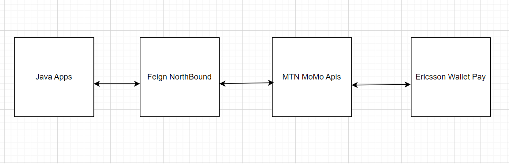
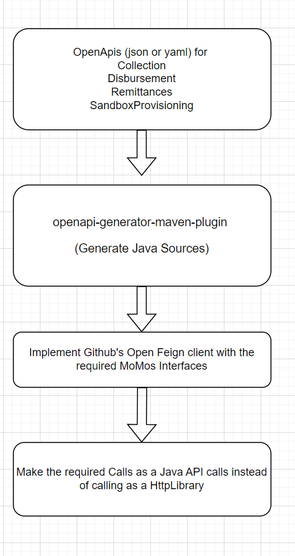

# Northbound Java API for MoMo - Mobile Money APIs and Ericsson Wallet Pay

## Purpose
To showcase a sample NorthBound Library for MoMos APIs and integrate with other Java Applications

## Sandbox Environment
The sandbox environment is chosen from https://momodeveloper.mtn.com/api-documentation/api-description

## What ?

## How ?

## Usecase - Request To Pay
https://momodeveloper.mtn.com/api-documentation/use-cases